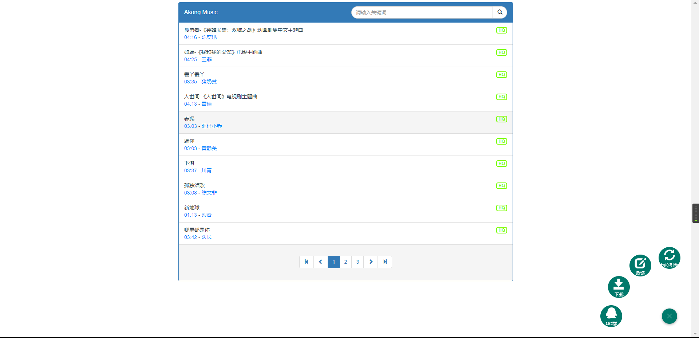
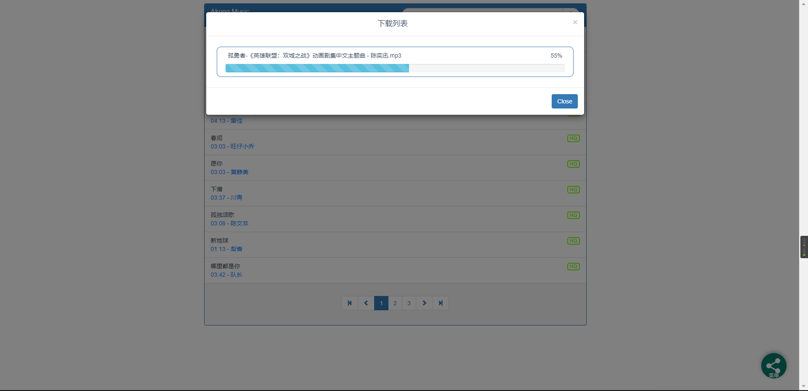
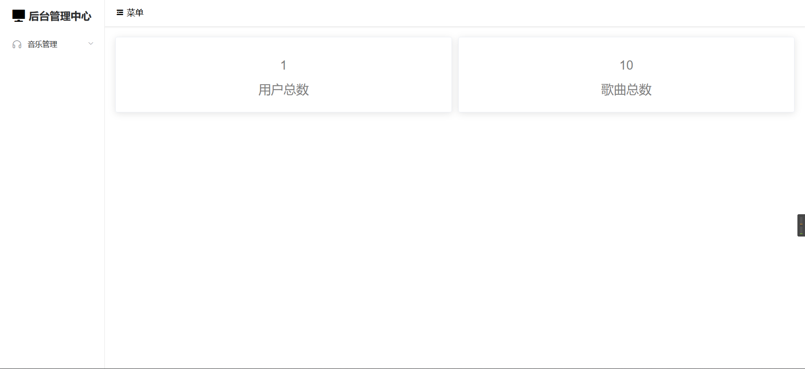

    
   <h2>- Akong -</h2>

## 简介
这是一款基于Spring+Vue构建的个人音乐网站

示例：[AkongMusic](https://music.akongwl.top/)
## 开发者
由Akong（本人）独立进行开发以及维护

感谢QQ群[AkongMusic](https://jq.qq.com/?_wv=1027&k=kPEC75Ek)的每一位群员的贴心测试
## 编译须知
该项目均由IDEA进行开发构建

采用原生Spring开发的Javaweb项目

需要手动进行tomcat的配置

代码每行均带有注释，可供自己进行二次开发

- 可与 [QQRobot](https://github.com/fanqiewl/QQRobot) 进行对接，实现QQ机器人在线音乐点播功能
- 该项目采用前后分离式开发
    - 前端采用Vue进行开发
    - 前端页面存放在该项目的AkongMusic目录
    - [前端文档](https://github.com/fanqiewl/AkongMusic/blob/master/AkongMusic/README.md)
- 音乐搜索分为两大引擎（酷我 && 永硕E盘）
    - 可自行在Ys168MusicUtil.java文件中对永硕E盘对接进行修改
    - 建议使用自己的永硕盘进行操作
- 后台界面已具雏形，待开发。。。
## 开发环境
- JDK 1.8
- IDEA 2021.1.1
- Maven 3.8.2
- tomcat 8.5.40

## 项目截图

    
    
    
    

